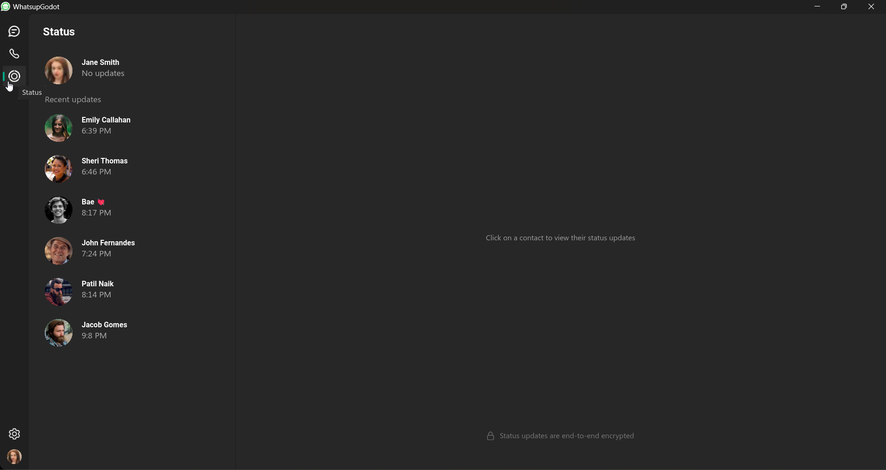

WhatsupGodot
=========================================

### A WhatsApp UI clone made using the Godot Game Engine for educational purposes only.

> ###### Disclaimer: This project is for educational purposes only. This project is not affiliated nor endorsed by WhatsApp LLC or Godot Engine in any way. The WhatsApp name, associated trade marks and logos are trade marks of WhatsApp or related entities.

## Table of contents
- [WhatsupGodot](#whatsupgodot)
  - [Table of contents](#table-of-contents)
  - [Support the project](#support-the-project)
  - [Contact](#contact)
  - [Motivation](#motivation)
  - [Features](#features)
  - [Screenshots](#screenshots)
  - [Demo videos](#demo-videos)

## Support the project

### Liked what you saw? You can support this project and other here!

- [Github Sponsor](https://github.com/sponsors/3ddelano)
- 

## Contact

- Join the Discord server for Godot discussions / help: [3ddelano Cafe](https://discord.gg/FZY9TqW)
- Get in touch for freelance projects: `Discord: @3ddelano`

## Motivation

The motivation for this project was to test the limits of Godot's UI system, to make smooth animations, to make a reactive UI, and to make a UI that is as close as possible to the original WhatsApp UI.

## Features

- Chats, Calls and Status pages 
- Send messages to contacts
- Reactive UI where needed
- Smooth animation using tweens 
- React.JS based pages/components folder structure

## Screenshots

- #### Chat messages

  

- #### Calls page

  

- #### Status page

  

## Demo videos

- #### Pages overview
  
  https://github.com/3ddelano/whatsup-godot/raw/main/_readme_assets/pages_overwiew.mp4

- #### Sending messages
  
  https://github.com/3ddelano/whatsup-godot/raw/main/_readme_assets/messaging_overview.mp4

- #### Responsive message size
  
  https://github.com/3ddelano/whatsup-godot/raw/main/_readme_assets/responsive_message.mp4

For Copyright and Attribution see `LICENSE.md` and `ATTRIBUTION.md`
